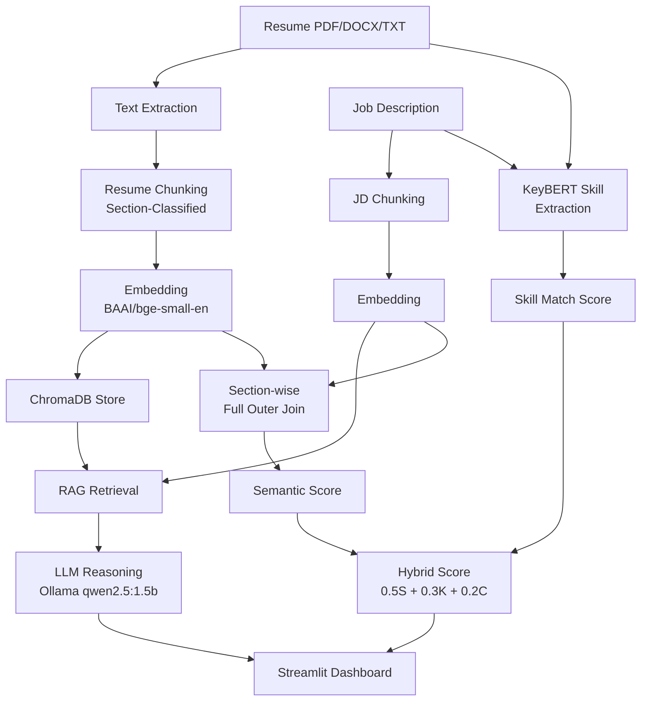

# Resume ↔ JD Matching System — Walkthrough

## What Was Built

A fully local, RAG-powered Resume ↔ Job Description matching system with **section-wise full outer join similarity**, **ChromaDB vector storage**, **dynamic skill extraction**, and **LLM reasoning**.

## Architecture



## Files Changed

| File | Action | Description |
|------|--------|-------------|
| [chunking.py](file:///c:/Users/Madha/OneDrive/Documents/Resume/app/chunking.py) | Rewrite | Section-classified chunking (SKILLS, EXPERIENCE, etc.) for resume; category-classified (REQUIREMENTS, RESPONSIBILITIES, etc.) for JD |
| [embeddings.py](file:///c:/Users/Madha/OneDrive/Documents/Resume/app/embeddings.py) | Rewrite | Accepts both string lists and chunk dicts |
| [vector_store.py](file:///c:/Users/Madha/OneDrive/Documents/Resume/app/vector_store.py) | **New** | ChromaDB in-memory store with section-filtered queries |
| [similarity.py](file:///c:/Users/Madha/OneDrive/Documents/Resume/app/similarity.py) | Rewrite | Section-wise full outer join producing a heatmap grid |
| [skill_extractor.py](file:///c:/Users/Madha/OneDrive/Documents/Resume/app/skill_extractor.py) | Rewrite | Lazy-loaded KeyBERT with MMR diversity |
| [skill_match.py](file:///c:/Users/Madha/OneDrive/Documents/Resume/app/skill_match.py) | Rewrite | Per-skill similarity scores with matched resume skill name |
| [feedback.py](file:///c:/Users/Madha/OneDrive/Documents/Resume/app/feedback.py) | Rewrite | [explain_match()](file:///c:/Users/Madha/OneDrive/Documents/Resume/app/feedback.py#15-42) + [generate_improvement_suggestions()](file:///c:/Users/Madha/OneDrive/Documents/Resume/app/feedback.py#44-91) via Ollama |
| [main.py](file:///c:/Users/Madha/OneDrive/Documents/Resume/main.py) | Rewrite | Full pipeline orchestration returning structured result dict |
| [app_ui.py](file:///c:/Users/Madha/OneDrive/Documents/Resume/app_ui.py) | Rewrite | Premium Streamlit dashboard with heatmap grid, skill chips, LLM reasoning |

## Key Design: Section-wise Full Outer Join

Every resume section (SKILLS, EXPERIENCE, PROJECTS, etc.) is cross-matched against every JD category (REQUIREMENTS, RESPONSIBILITIES, SKILLS, etc.) using cosine similarity. The result is a **heatmap grid** showing alignment strength per cell — like a full outer join.

## Verification Results

**CLI pipeline test** with sample data:
```
MATCH SCORE: 94.7%
  Semantic:   89.4%
  Skill:      100.0%
  Coverage:   100.0%

Section Mapping Grid:
  EXPERIENCE   <-> REQUIREMENTS  ->  0.894

Matched Skills: 30/30
Missing Skills: 0
```

## How to Run

```powershell
cd c:\Users\Madha\OneDrive\Documents\Resume

# CLI test
.venv\Scripts\python.exe main.py

# Streamlit UI
.venv\Scripts\python.exe -m streamlit run app_ui.py
```

> [!NOTE]
> Make sure Ollama is running locally with `qwen2.5:1.5b` pulled for LLM reasoning features. The system works without LLM too (toggle off in sidebar).
